<div align="center">


# 🚗 车溯安

**面向智能汽车事故溯源追责的区块链可信存证系统**

*端侧不遗漏 · 云侧能解释 · 链侧可核验*

`20Hz 取证` · `可解释责任` · `LLM 复盘` · `Fabric 存证`


</div>

---

## 📖 目录

- [💡 这是什么](#-这是什么)
- [⚡ 一分钟看懂](#-一分钟看懂)
- [📱 界面预览](#-界面预览)
- [📂 仓库结构](#-仓库结构)
- [🏗️ 系统架构](#️-系统架构)
- [🔧 核心模块](#-核心模块)
  - [① 20Hz 滑动窗口取证](#-20hz-滑动窗口取证)
  - [② 结构化证据包 E](#-结构化证据包-e)
  - [③ 可解释责任初判](#-可解释责任初判)
  - [④ 端侧轻量 MLP](#-端侧轻量-mlp16-维--8-隐藏--双头)
  - [⑤ 云端 AI 事故重建](#-云端-ai-事故重建)
  - [⑥ 区块链轻量化存证](#-区块链轻量化存证)
- [🚀 快速上手](#-快速上手)
- [🌐 应用场景](#-应用场景)

---

## 💡 这是什么

智能汽车出事故后，责任怎么定？行车记录仪只能拍画面，拍不到 AEB 有没有触发、驾驶员什么时候踩的刹车、转向角怎么变的。车厂后台有日志，但数据在车厂自己手里，车主和保险敢信吗？

**车溯安**是一套端—云—链三方协同的事故追责系统：

- 📱 **车端 App**（Android Automotive）— 20Hz 实时采样，事故触发瞬间冻结前后 10s 数据，本地完成责任初判和风险研判
- ☁️ **云端服务**（FastAPI + LLM）— 把专业行车数据翻译成任何人能读懂的九字段事故复盘报告
- ⛓️ **链上存证**（Hyperledger Fabric）— 完整数据留本地保护隐私，Hash 摘要进联盟链，任何时候拿 Hash 能验

三端可独立运行，也可以协同完成从事故取证到链上核验的完整闭环。

---

## ⚡ 一分钟看懂

> 事故往往只给系统 **十几秒** 说话——车溯安在这十几秒里把数据冻住、算清、写进链，事后任何人拿 **Hash** 都能验。

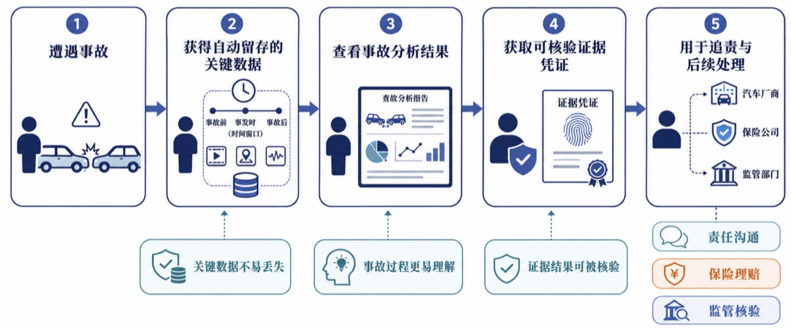

| 阶段 | 做什么 | 系统表现 |
|:----:|--------|----------|
| 📡 ① 监控 | 20Hz 持续采样，环形缓冲滚动 | 安全中心 · 前台服务常驻 |
| 🧊 ② 冻结 | 碰撞/AEB 触发后锁定前 10s + 后 10s | 事故列表 · 时间轴回放 |
| ⚖️ ③ 初判 | 人/机/环境三维归因 + MLP 研判 | 详情页可解释责任指标 |
| 🤖 ④ 复盘 | 结构化 Prompt → LLM 九字段报告 | 详情页 AI 分析区 |
| 🔗 ⑤ 存证 | SHA-256 摘要上链 | 上链按钮 → Hash / TxId |
| ✅ ⑥ 核验 | 本地重算 vs 链上账本 | `chaincode.html` 浏览器查 Hash |

---
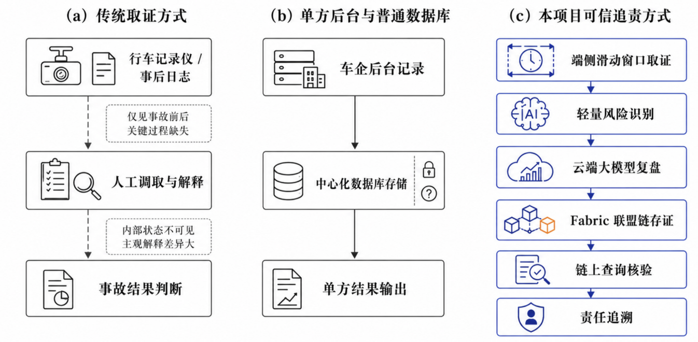
## 📱 界面预览

<p align="center"><b>安全中心</b> — 事故监测与安全模块总览</p>
<p align="center">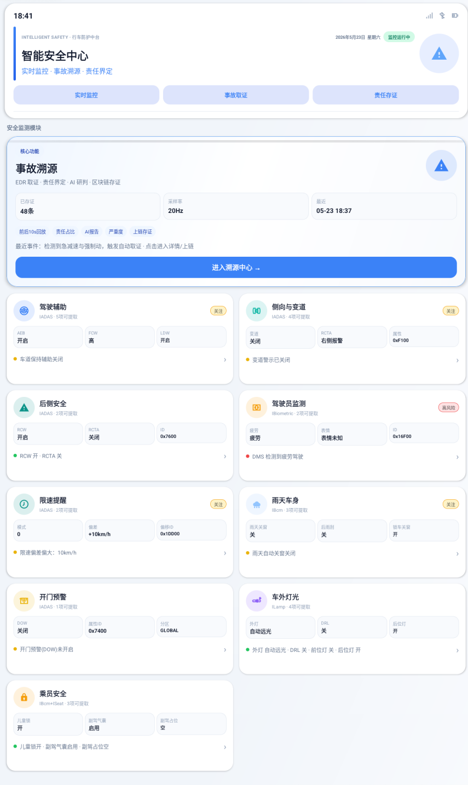</p>

<p align="center"><b>上链成功</b> — Hash 存证结果与交易凭证</p>
<p align="center">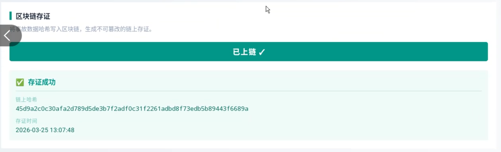</p>

<p align="center"><b>车机大屏</b> — 车载实机联调环境</p>
<p align="center">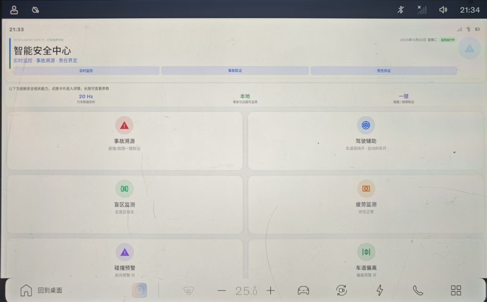</p>


---

## 📂 仓库结构

```text
车溯安/
│
├── app/                          # 📱 Android 车端应用（com.csa.chesuan）
│   └── src/main/java/com/example/vehtrust/
│       ├── MainActivity.kt               # 安全中心主界面
│       ├── AccidentTraceActivity.kt      # 事故列表页
│       ├── AccidentTraceDetailActivity.kt # 事故复盘详情页
│       ├── SafetyViewModel.kt            # 安全中心数据层
│       │
│       ├── service/
│       │   └── AccidentMonitorService.kt # ⚡ 20Hz 后台监测服务，环形缓冲+触发冻结
│       │
│       ├── trace/                        # 🔍 事故取证与溯源
│       │   ├── ResponsibilityAnalyzer.kt # 可解释责任初判（5项指标→三维归因）
│       │   ├── BlockchainApi.kt          # 链上存证接口（POST /upload）
│       │   ├── OpenAiAnalysisApi.kt      # 云端 AI 复盘接口
│       │   ├── AccidentContextGenerator.kt # 结构化证据包 E 生成
│       │   ├── AccidentReplayView.kt     # 事故时间轴回放组件
│       │   └── AccidentSiteCoordinates.kt # 事故坐标定位
│       │
│       ├── data/                         # 📊 数据模型与解析
│       │   ├── CarExtPropertyIds.kt      # 车机属性 ID 映射（17+ 字段）
│       │   ├── ModuleCatalog.kt          # 安全模块枚举
│       │   ├── ModuleMetric.kt           # 模块指标定义
│       │   └── ModuleParamValueResolver.kt # 车辆参数值解析
│       │
│       ├── db/                           # 💾 Room 本地数据库
│       │   ├── AccidentDatabase.kt       # 事故数据库定义
│       │   ├── AccidentDao.kt            # 事故数据访问层
│       │   └── AccidentEntities.kt       # 事故实体类
│       │
│       ├── mock/
│       │   └── MockDataProvider.kt       # 🧪 模拟车机数据（预留真实信号替换入口）
│       │
│       └── assets/
│           └── collision_severity_model.json # 🧠 MLP 端侧模型（离线推理）
│
├── backend/                      # ☁️ FastAPI 云端 AI 服务
│   ├── main.py                   # POST /api/accident/analyze — 三层输入+五层Prompt
│   └── requirements.txt          # Python 依赖
│
├── chaincode_and_API/            # ⛓️ Hyperledger Fabric 联盟链
│   ├── chaincode/                # Go 智能合约（asset.go — Hash 存证+回查）
│   ├── main.go                   # Go API 网关（:8080 — 封装链码调用）
│   ├── chaincode.html            # 浏览器链上核验页（输入Hash→返回存证JSON）
│   └── README.md                 # 链端部署说明
│
├── EcarX-CarExt-SDK/             # 🚘 亿咖通车载扩展 SDK 参考文档
│
├── VehTrust_Carui/               # 🖥️ 车机大屏 UI 可选包
│
├── demo/                         # 📸 演示素材
│   ├── figures/                  # 架构图（fig01~fig12.png）
│   ├── 图片13.png              # 安全中心 截图
│   ├── chain.png / chain.mp4    # 上链成功 截图/录屏
│   ├── analysis.mp4             # 事故分析 录屏
│   └── CarScreen.jpg            # 车机大屏 实拍
│
├── csa.png                       # Logo
└── README.md                     # 本文件
```

---

## 🏗️ 系统架构

车溯安采用 **端—云—链** 三端协同架构：端侧靠近事故现场做低时延取证，云端承担 LLM 推理做因果复盘，链上提供不可篡改的存证凭证。

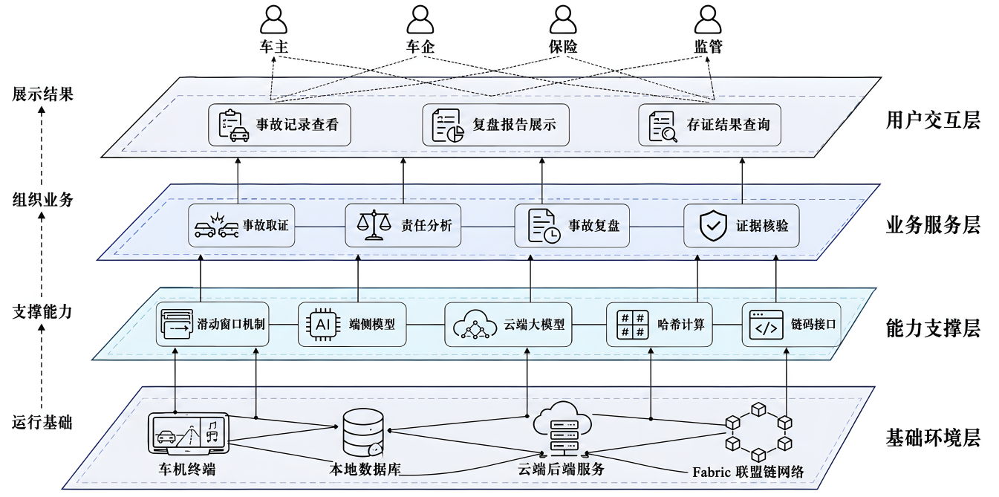


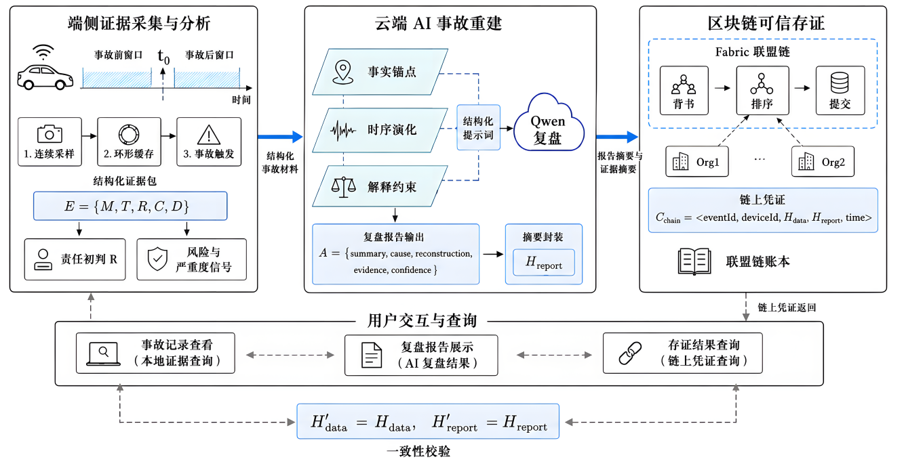


**三端各司其职，可独立可协同：**

| 端 | 部署位置 | 核心职责 | 离线可用？ |
|---|---------|---------|:--------:|
| 📱 **车端** | Android Automotive 车机 | 20Hz 采样、窗口冻结、责任初判、MLP 推理 | ✅ 独立完成取证 |
| ☁️ **云端** | FastAPI 服务器 | 接收结构化证据、五层 Prompt 调 LLM、生成复盘报告 | ✅ 车端可暂存后补传 |
| ⛓️ **链端** | Fabric 联盟链 + Go 网关 | 哈希摘要上链、多组织背书、`chaincode.html` 核验 | ✅ 车端本地缓存后批量上链 |

---

## 🔧 核心模块

系统由六个模块串联，形成从"数据怎么采"到"证据怎么验"的完整管线。

### ① 20Hz 滑动窗口取证

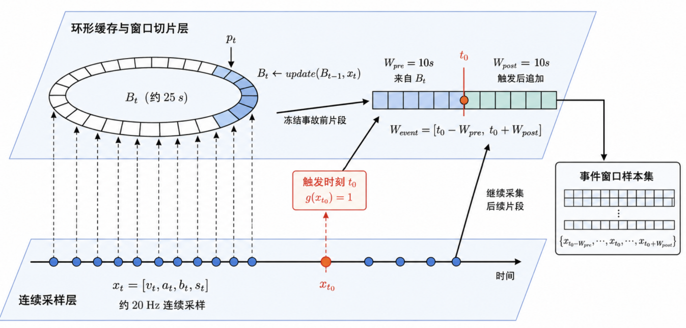

车端在行驶中持续以 **20 Hz** 采样，数据写入约 **25 s** 环形缓冲。当 `IMPACT_DETECTED` 或 AEB 触发时，立即冻结事故前后关键片段：

```
W_pre  = [ t₀ − 10s ,  t₀ )        ← 事故前驾驶演化
W_post = [ t₀ ,  t₀ + 10s ]        ← 事故后系统响应
W_event = W_pre ∪ W_post           ← 完整事件窗口
```

| 关键实现 | 文件 |
|----------|------|
| 后台监测 | `AccidentMonitorService.kt` |
| 触发逻辑 | `AccidentMonitor.kt` |
| 持久化 | Room 本地数据库 |

### ② 结构化证据包 E

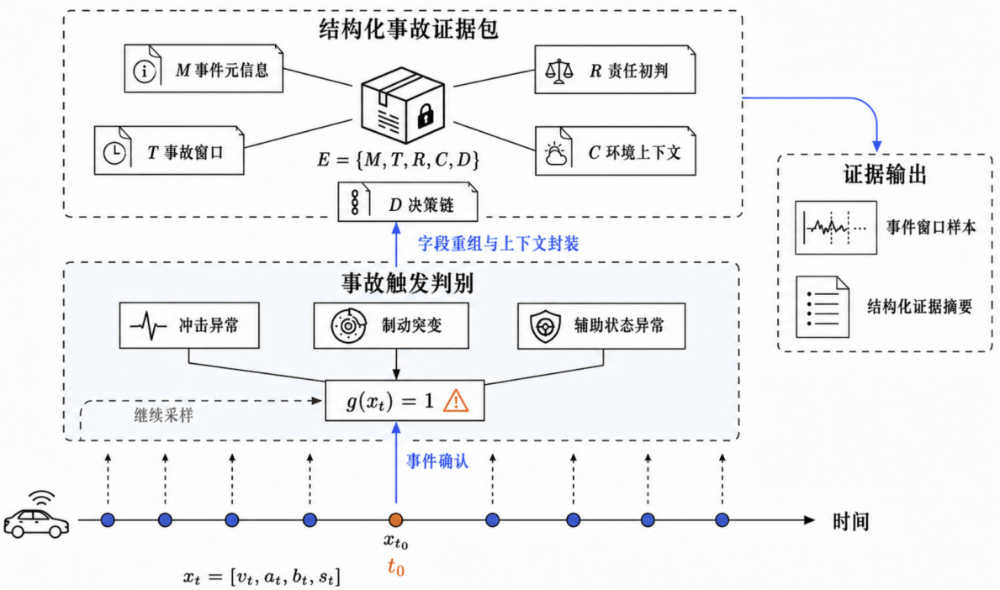

原始遥测不直接传递，而是封装为结构化六元组：

```
E = { M, T, R, C, D, A }
```

| 块 | 内容 | 作用 |
|----|------|------|
| **M** 元信息 | 编号·时刻·设备·事故类型·严重度 | 索引与链上查询键 |
| **T** 遥测窗口 | 速度·加速度·制动·转向 时序 | 还原事故动态曲线 |
| **R** 责任初判 | 人/机/环境三维归因 + 置信度 | 为云端 LLM 提供归因边界 |
| **C** 环境上下文 | 天气·路况·光照·障碍物 | 限定外部条件 |
| **D** 决策链 | 感知→规划→控制→执行 全链路 | 追查系统行为依据 |
| **A** AI 报告 | LLM 九字段复盘（后补） | 面向人类阅读的事故说明 |

### ③ 可解释责任初判

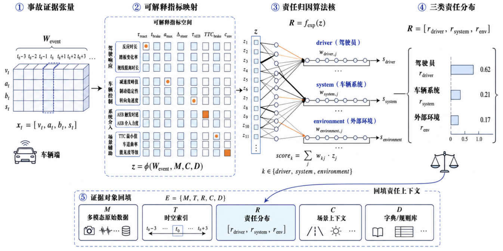

端侧**不下最终判决书**，只输出带来源线索的初判结果。每条归因都能回溯到具体指标：

| 指标 | 测量方式 | 指向 |
|------|----------|------|
| 反应时间 | 危险减速出现 → 制动踏板达 20% | 驾驶员响应 |
| 制动建立时间 | 踏板 20% → 80% | 驾驶员果断性 |
| 峰值减速度 | 窗口内最大制动强度 | 车辆制动能力 |
| AEB 延迟 | 系统介入时刻 vs t₀ | 主动安全响应 |
| 制动初始 TTC | 制动开始时的碰撞时间 | 整体避险窗口 |

### ④ 端侧轻量 MLP（16 维 → 8 隐藏 → 双头）

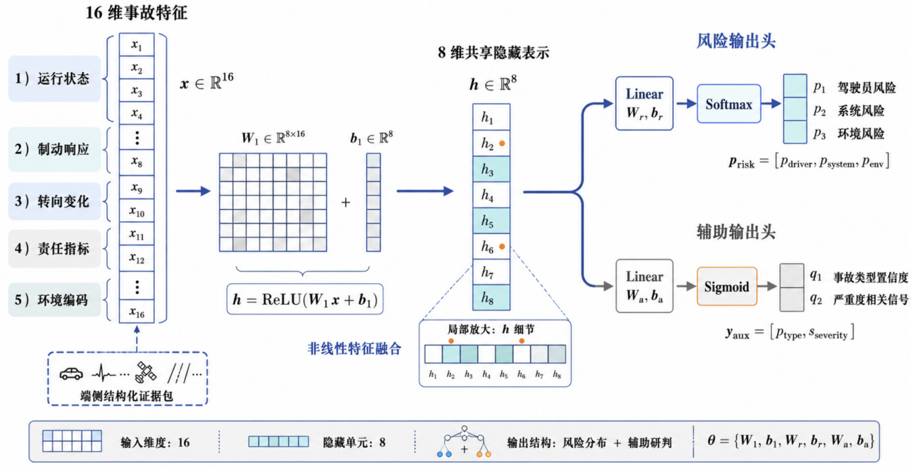


- 输入已是 16 维结构化特征，不是高维原始数据，单隐藏层 8 神经元即可捕获复合模式
- 与责任初判**分工**：初判保留"证据→结论"链路，MLP 学习规则难覆盖的复合风险
- 模型文件：`app/src/main/assets/collision_severity_model.json`，离线推理，分类 Fatal / Serious / Slight

### ⑤ 云端 AI 事故重建

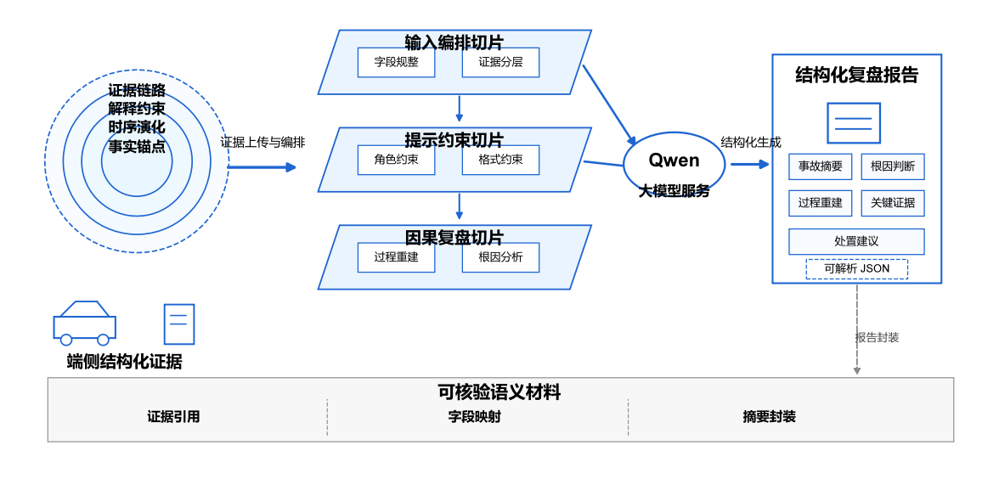

端侧输出仍是专业数据，普通用户读不懂。云端将"机器的语言"翻译成"人的理解"——**但不以大模型替代证据，而是在证据约束下重建因果**。

**三层结构化输入：**

```
I_cloud = { F_anchor,  T_evolution,  C_explain }
           事实锚点      时序演化        解释约束
```

- **事实锚点层** — 事件类型、时刻、地点、触发原因、严重度、辅助驾驶状态
- **时序演化层** — 速度、加速度、制动强度、转向角 遥测序列
- **解释约束层** — 端侧责任初判、环境快照、决策链

**五层 Prompt 约束生成边界：**

```
P_prompt = { P_role, P_evidence, P_causal, P_format, P_verify }
```

| 层次 | 内容 | 防止的问题 |
|------|------|-----------|
| 🎭 角色层 | 车载事故分析专家身份 | 模型做泛化回答 |
| 📦 证据层 | 多源证据按复盘逻辑分块 | 忽略关键字段 |
| 🔗 因果层 | 摘要→根因→过程→证据→建议 | 输出缺乏逻辑 |
| 📐 格式层 | 九字段固定 JSON | 前端解析失败 |
| 🛡️ 可信层 | 禁止虚构、置信标注、缺失标记 | 编造不存在的事实 |

输出九字段 JSON：事故摘要 · 根因判断 · 过程重建 · 关键证据 · 处置建议。

| 接口 | `POST /api/accident/analyze` | 实现 | `backend/main.py` |
| 车端调用 | `OpenAiAnalysisApi.kt` | | |

### ⑥ 区块链轻量化存证

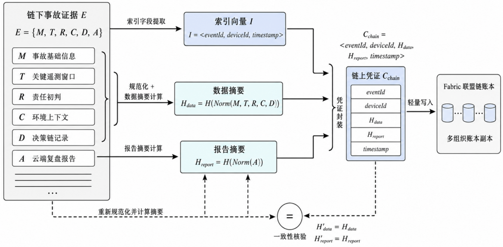

Hyperledger Fabric 联盟链提供多组织背书，但**不存全量数据**——只存不可篡改的哈希锚点：


`H_data = SHA256(deviceId + dataJson + txID)` — 确定性哈希，任何人拿原始数据重算即可核验。

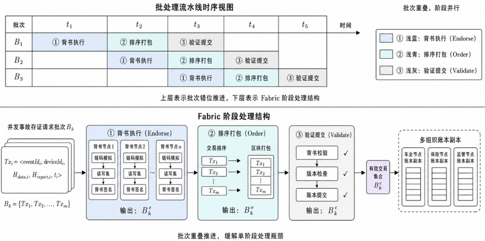

```
App ──POST /upload──▶ Go :8080 ──▶ Fabric 链码（执行→排序→验证）
                         │
                         ├── 返回 { hash, txId }
chaincode.html ──GET /query?hash=...──▶ 链上回查 → 核验 JSON
```

**车机联调**：`adb reverse tcp:8080 tcp:8080` → App 直接访问 `127.0.0.1:8080` 上链。

---

## 🚀 快速上手

```bash
# 构建
.\gradlew.bat :app:assembleDebug

# 安装到车机
adb install -r app\build\outputs\apk\debug\app-debug.apk
```

**启动区块链服务**（详见 [`chaincode_and_API/README.md`](chaincode_and_API/README.md)）：

```bash
adb reverse tcp:8080 tcp:8080   # 车机 → 本机 Fabric
# 浏览器打开 chaincode.html 即可查询核验
```

**启动 AI 后端**（可选）：

```bash
cd backend && pip install -r requirements.txt
python -m uvicorn main:app --host 0.0.0.0 --port 8080 --reload
```

| 配置项 | 文件 | 值 |
|--------|------|----|
| 链上接口 | `BlockchainApi.kt` | `127.0.0.1:8080` |
| AI 接口 | `OpenAiAnalysisApi.kt` | `10.0.2.2:8080`（模拟器） |
| 应用包名 | `build.gradle.kts` | `com.csa.chesuan` |

---

## 🌐 应用场景

| 场景 | 价值 |
|------|------|
| ⚖️ 事故责任辅助认定 | 车主举证 · 车企技术说明 · 事故技术分析 |
| 🏦 车险理赔 | 快速 Hash 核验 · 结构化复盘报告 · 降低争议 |
| 🔬 第三方检测鉴定 | 跨主体可追溯 · Hash 防篡改 · 电子证据固化 |
| 🏭 车企质量改进 | AEB 延迟分析 · 接管提醒优化 · 辅助驾驶迭代 |
| 🏙️ 车路云监管 | 区域异常统计 · 事故溯源 · 城市交通安全治理 |

---

<div align="center">

**🚗 车溯安**

端侧把证据留住 · 云端把过程讲清 · 链上把凭证钉死

</div>
