# 溯安行——车辆事故智能化溯源平台·系统测试文档

 

## 目录

*此目录在 Word 中可通过"引用 → 目录 → 自动目录"生成，以下为 Markdown 占位。*

[TOC]

---

## 1. 系统功能测试概述

本文档针对溯安行——车辆事故智能化溯源平台进行系统功能测试，测试平台为 Android Studio 内置模拟器（Automotive系列），比例与真实车机相近。

本部分对系统的功能进行验证，以确保系统能够正常运作。测试包括基本功能测试、可靠性测试和可用性测试，每个测试部分都有不同的重点和目标。

可靠性测试关注系统在各种情况下的反应和表现，包括屏蔽用户误操作、提供正确的错误提示信息以及对异常情况的处理，旨在验证系统能够稳定运行并能正确处理用户的输入和操作。

可用性测试关注系统的用户体验和界面设计，评估系统是否提供必要的操作指导信息，界面是否简洁、美观、实用，以及页面渲染是否一致，确保系统易于使用，用户能够方便地进行操作和获取所需信息。

通过以上测试的综合评估，可以全面了解系统的功能表现、稳定性和用户体验，为系统的进一步优化和改进提供参考依据。

---

## 2. 前端页面测试

### 2.1 首页及功能选择页面

为了展示溯安行——车辆事故智能化溯源平台的功能和实现流程，本团队开发了相应的 Android 前端展示系统。该系统主页提供了 **9 个安全功能模块**的入口，包括驾驶辅助、侧向与变道、后侧安全、驾驶员监测、限速提醒、雨天车身、开门预警、车外灯光和乘员安全，以及一个占据双列宽度的"事故溯源"核心入口卡片。通过这些模块，用户可以直观地了解和使用系统提供的多维度安全监测和事故溯源服务。

主页顶部卡片展示实时时钟、日期和"监控运行中"状态标识，下方设有"实时监控""事故取证""责任存证"三个功能标签，表明系统以 20Hz 频率持续监控车辆传感器数据。系统启动时自动拉起前台监控服务，通知栏显示"事故溯源监控运行中 · 20Hz 高频采样 · 保留事故前后各 10 秒数据"等关键信息，确保用户明确知晓系统处于后台监测状态。

在首页的功能选择部分，用户可以点击不同的功能模块进行详细操作：
- 点击"事故溯源"卡片进入事故事件列表页面，查看和分析历史事故记录；
- 点击其余 9 个安全模块卡片则进入模块详情页，展示对应模块的图标、名称、功能描述、能力标签、可提取参数列表和实时状态值，用户可通过顶部返回按钮回到主页。
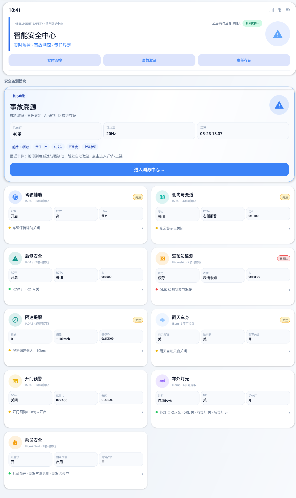

**图 2-1 系统首页及功能选择页面**

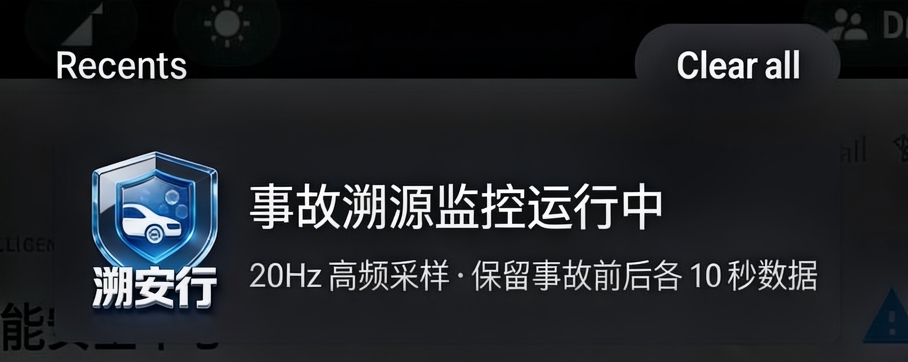

**图 2-2 前台服务通知栏**

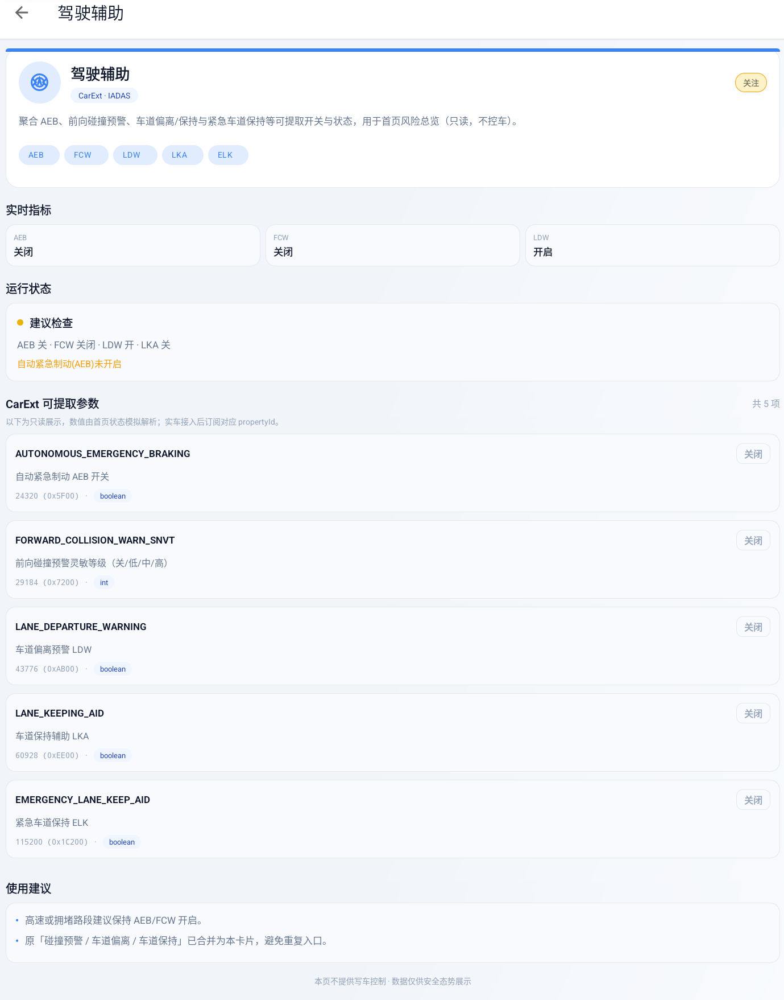

**图 2-3 模块详情页**

### 2.2 事故溯源列表页面

事故溯源列表页面展示系统已检测并持久化的事故事件记录。数据来源包括内置的预置示例数据以及前台监控服务实时检测生成的新事件。列表中的每条记录展示事件 ID、事故发生时间、地理位置信息和简要原因描述，帮助用户快速浏览和定位关注的事故。用户点击任一事件条目后，页面跳转至对应的事故溯源详情页，获取该事故的完整多维度分析报告。
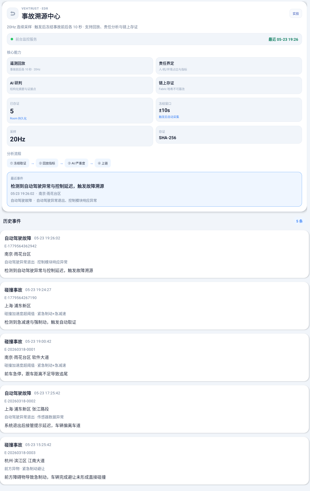

**图 2-4 事故溯源列表页**

### 2.3 事故溯源详情页面

事故溯源详情页是系统的核心功能载体，集成了多个功能模块。页面采用纵向滚动布局，用户可通过上下滑动浏览全部分析内容。以下按页面顺序依次介绍各功能模块。

#### 2.3.1 事件基本信息与事发位置地图

页面顶部为事件基本信息卡片，展示事故 ID、事故类型、发生时间、地理坐标和触发原因摘要。事发位置地图模块通过内嵌 WebView 加载交互式地图，标注事故 GPS 坐标，支持双指缩放和拖动操作，地图下方显示坐标文本并提供"在外部地图应用中打开"按钮，可调用系统地图应用查看同一坐标。
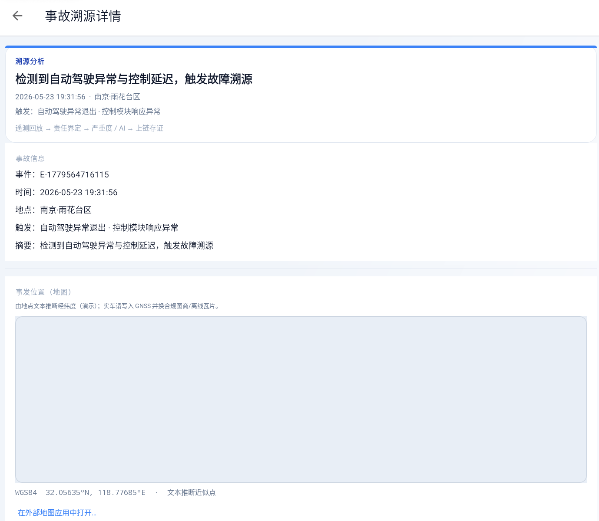

**图 2-5 事件基本信息与事发位置地图**

#### 2.3.2 责任分析指标

责任分析指标区域展示六项关键可解释指标，以横向卡片形式排列：

| 指标 | 说明 |
|------|------|
| 反应时间 | 从危险检测到驾驶员开始制动的时间间隔 |
| 制动上升时间 | 制动压力从 20% 升至 80% 的耗时 |
| 峰值减速度 | 制动过程中最大纵向减速度 |
| AEB 介入延迟 | 自动紧急制动相对事故时刻的延迟 |
| 制动时 TTC | 开始制动时的碰撞剩余时间 |
| 制动有效性 | 2 秒内是否达到强制动 |

每项指标附有评估标签（如"正常""偏长""果断""碰撞级"等），帮助用户快速理解事故中的驾驶员操作特征和车辆动态响应。
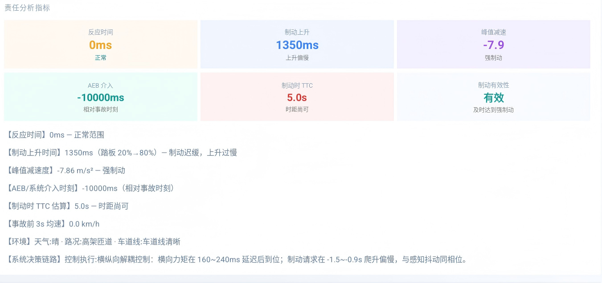

**图 2-6 责任分析指标**

#### 2.3.3 责任界定

责任界定模块综合责任分析结果，输出驾驶员、系统、环境三方的责任占比，以加权进度条和百分比数值可视化展示，并附有详细的分析说明文本。
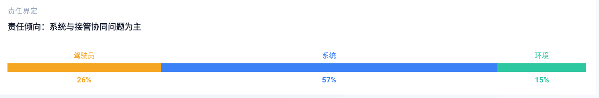

**图 2-7 责任界定**

#### 2.3.4 深度学习时序分析

深度学习时序分析模块基于深度学习模型对事故时序数据进行端侧推理，输出模型名称、预测标签、整体风险评分和事故类型置信度，以及驾驶员风险、系统风险、环境风险三项分项评分，附带关键证据点列表。
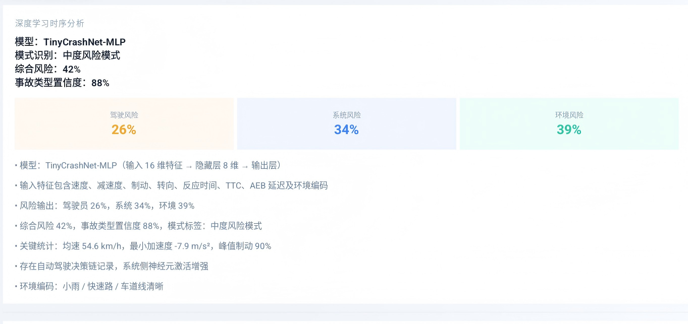

**图 2-8 深度学习时序分析**

#### 2.3.5 碰撞严重度预测

碰撞严重度预测模块基于内置随机森林模型进行离线推理，无需网络连接即可运行。用户点击"生成碰撞严重度预测"按钮后，系统在 3 秒内返回结构化结果，包括：

- 预测分类（致命 / 重伤 / 轻微）
- 置信度百分比
- 严重度指数（0~100）
- 三项分类的概率分布表
- 关键影响因素列表
- 模型版本说明

该模块实现了在无网络环境下的端侧智能决策支持。
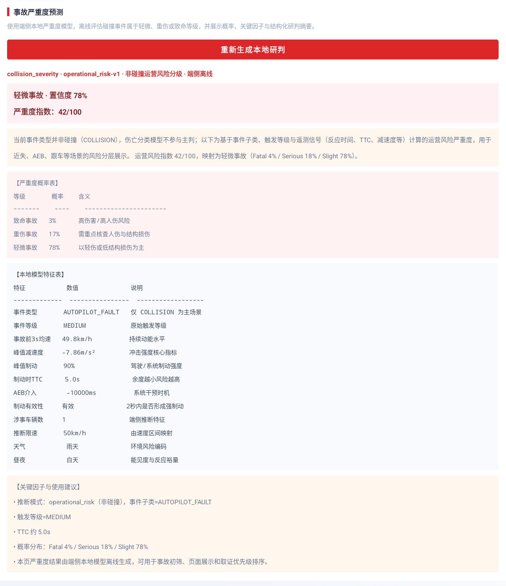

**图 2-9 碰撞严重度预测**

#### 2.3.6 AI 事故分析

AI 事故分析模块调用后端大模型进行深度分析。当后端服务正常运行时，用户点击"发起 AI 事故分析"按钮后，系统等待 5~30 秒返回结构化分析结果，包含以下字段：

- 事故摘要（自然语言总结）
- 责任判断（系统判断的主要归因）
- 综合分析（多维度详细分析）
- 证据点列表（支持判断的关键事实）
- 改进建议（针对驾驶员、系统和环境的分项措施）
- 模型说明（使用的模型和参数）

当后端服务未启动或网络不可达时，系统自动触发离线降级机制，显示明确的状态提示文案，并由本地规则引擎生成模板化的分析结果，确保用户在离线环境下仍可获得基本的分析参考，避免出现空白页面或崩溃异常。
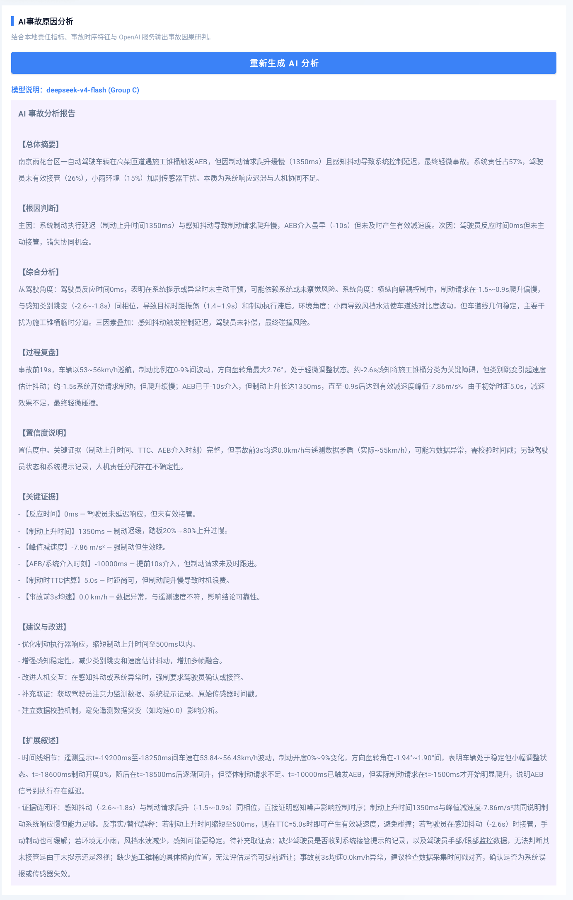

**图 2-10 AI 分析成功结果**

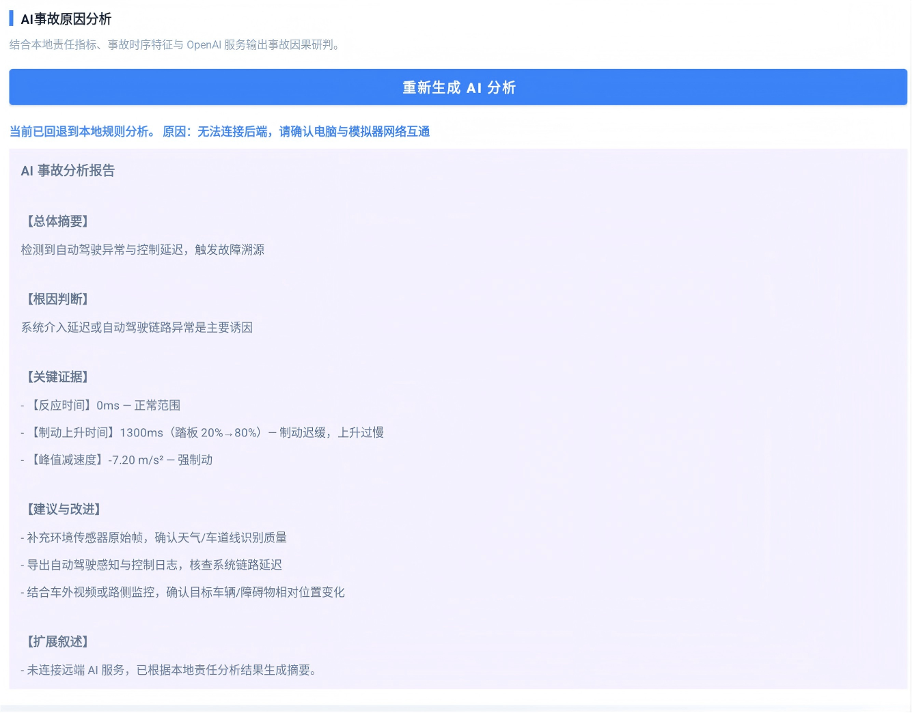

**图 2-11 AI 分析离线降级结果**

#### 2.3.7 事故动画放映

事故动画放映模块是系统中交互性最强的功能组件。系统以碰撞触发时刻为原点，截取前 10 秒至后 10 秒的传感器数据窗口，以 20Hz 采样率生成遥测数据点。页面集成 3D 场景回放视图，同步驱动道路场景、仪表 HUD 读数和遥测曲线，使用同一播放头控制。

用户可通过进度条拖动到任意时间点，也可以使用播放、暂停按钮控制自动回放。回放过程中实时更新对应时刻的车速、加速度、制动、转向等数据。
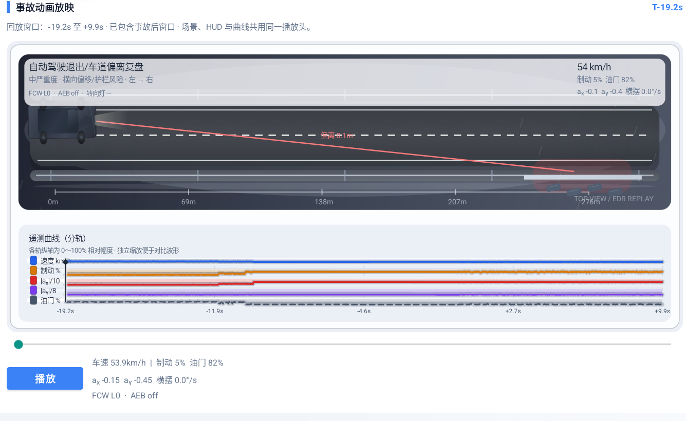

**图 2-12 事故动画放映**

#### 2.3.8 遥测数据表

遥测数据表以表格形式展示事故前 10 秒的关键时序采样数据，包括时间、速度、加速度、刹车深度和转向角度。同时展示采样摘要信息，包括均速、峰值速度、峰值制动等统计值。
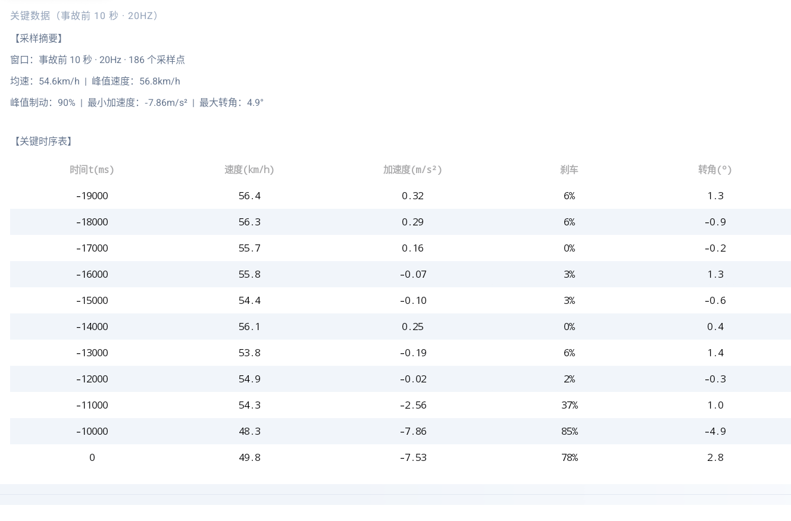

**图 2-13 遥测数据表**

#### 2.3.9 系统决策链路与环境

系统决策链路模块展示自动驾驶系统在事故窗口内的感知→决策→执行链路信息，包括传感器输入、感知结果、规划路径和控制指令。同时展示环境快照，包括天气、路况、障碍物和车道线状态。
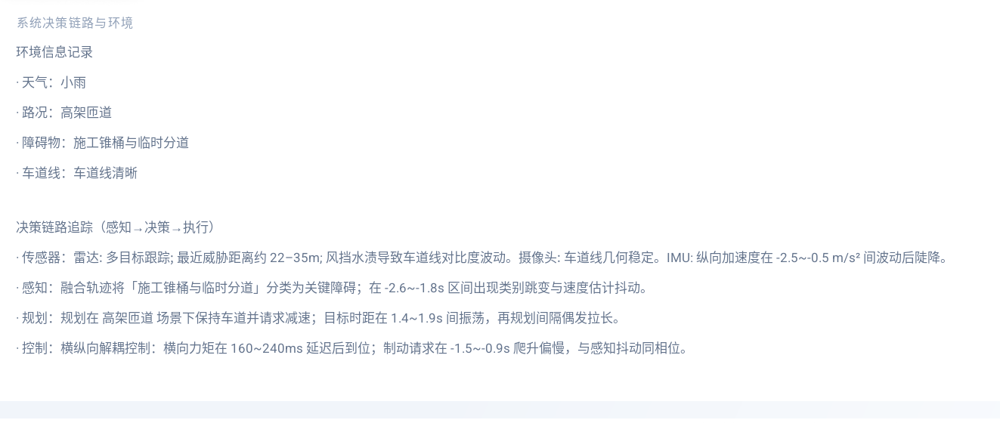

**图 2-14 决策链路与环境**

#### 2.3.10 区块链存证

区块链存证模块将事故证据摘要（含事件 ID、时间戳、责任分析结论和碰撞严重度结果）上传至区块链网络，获取不可篡改的交易哈希和时间戳作为存证凭证。

- **存证成功**：页面显示绿色的成功状态标识、交易哈希值和上链时间戳，上链按钮状态变更为"已存证"并禁用，防止重复提交。
- **存证失败**：当区块链服务不可达或返回错误时，系统在 10 秒超时后显示红色错误提示信息和可点击的"重试上链"按钮，允许用户排除故障后重新发起存证请求。
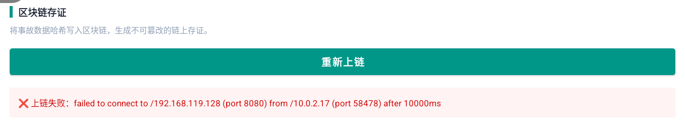

**图 2-15 区块链存证成功**

**图 2-16 区块链存证失败**

#### 2.3.11 小结

事故溯源详情页通过以上功能模块的有机结合，为用户提供了从事故事实展示、事发地图定位、传感器数据回放、端侧智能分析、深度学习研判、云端推理到区块链可信存证的完整闭环体验。无论是在线还是离线环境，系统均能通过降级机制保障分析功能的可用性。

---

## 3. 系统功能测试

### 3.1 基本功能测试

**表 3-1 基本功能测试**

| 序号 | 测试用例 | 测试过程描述 | 测试结果 |
|------|---------|-------------|---------|
| 1 | 前台服务启动 | 在模拟器中安装并启动 App，下拉通知栏观察 | 通知栏存在前台服务通知，标题"事故溯源监控运行中"，内容包含"20Hz 高频采样""保留事故前后各 10 秒数据" |
| 2 | 模块卡片点击 | 点击"驾驶辅助"等安全模块卡片，返回后点击"事故溯源" | 安全模块进入详情页，展示图标、名称、描述、能力标签和参数列表；"事故溯源"进入列表页 |
| 3 | 事故列表展示 | 从主页进入事故溯源列表 | 列表正常渲染，展示事件 ID、时间、位置、原因，存在预置示例数据和监控触发记录 |
| 4 | 详情页加载 | 点击列表中任一事故条目 | 详情页完整渲染：事件信息、地图区、责任指标、责任界定、深度学习、严重度预测、AI 分析、回放、遥测表、决策链路、区块链，无白屏 |
| 5 | 遥测回放操作 | 拖动进度条，点击播放、暂停 | 3D 场景与 HUD 读数随进度条实时同步更新，播放时进度条匀速推进，暂停后可从暂停点继续 |
| 6 | 碰撞严重度预测 | 断开网络后点击生成预测 | 3 秒内返回致命/重伤/轻微三分类、置信度百分比、严重度指数（0~100）、概率分布表和关键影响因素 |
| 7 | AI 在线分析 | 启动后端服务，确保网络连通，点击 AI 分析 | 返回包含事故摘要、责任判断、综合分析、证据点列表、改进建议和模型说明的完整结构化结果 |
| 8 | AI 离线降级 | 关闭后端服务，再次点击 AI 分析 | 显示"当前已回退到本地规则分析"提示，返回模板化分析结果，无崩溃无白屏 |
| 9 | 地图加载 | 进入详情页观察地图区域 | 交互式 Leaflet 地图正常加载 OSM 瓦片，事故坐标处显示蓝色圆形标记和精准定位点，支持双指缩放 |
| 10 | 区块链存证成功 | 点击上链按钮 | 约 1 秒内返回交易哈希（0x 开头）和时间戳，按钮文本变更为"已上链 ✓"并禁用 |
| 11 | 区块链存证失败 | 模拟链服务不可达场景 | 当前版本采用本地模拟存证，始终返回成功；远程链失败场景留待后续集成测试 |

### 3.2 可靠性测试

**表 3-2 可靠性测试**

| 序号 | 测试场景 | 测试过程描述 | 测试结果 |
|------|---------|-------------|---------|
| 1 | 屏蔽用户误操作 | 2 秒内连续点击"AI 分析"按钮 10 次 | 仅发起一次请求，后续点击被 btnAnalyzeAi.isEnabled = false 拦截，UI 保持响应不卡死 |
| 2 | 错误正确提示 | 后端返回 HTTP 500 错误 | 显示"当前已回退到本地规则分析"提示并自动降级，不弹窗报错，不影响页面其他功能 |
| 3 | 异常输入不崩溃 | 传入不存在的 eventId | loadDetail 返回空数据时各渲染方法检测到空值，对应区域显示占位文本，不抛出 NPE |
| 4 | 空数据处理 | 遥测数据为空或部分字段缺失时进入详情 | 遥测区显示"暂无事故前遥测数据"，回放区显示"暂无可放映的遥测窗口"，无异常崩溃 |
| 5 | 后台恢复 | 详情页按 Home 键，5 分钟后切回 | 前台服务通知持续存在，onResume 刷新 WebView，页面数据完整，无 ANR |

### 3.3 可用性测试

**表 3-3 可用性测试**

| 序号 | 测试场景 | 测试过程描述 | 测试结果 |
|------|---------|-------------|---------|
| 1 | 操作指导信息 | 检查各页面是否具有必要的引导信息 | 各页面标题清晰（溯安行/事故溯源中心/事故溯源详情），模块名称准确，导航路径明确（返回按钮、物理返回键） |
| 2 | 界面风格一致性 | 在各页面之间切换，观察视觉风格 | 全局色彩统一（蓝 #3B82F6 品牌色），卡片圆角 12dp 和阴影风格一致，字体层级分明（Hero/title/body/caption） |
| 3 | 屏幕方向适配 | 在模拟器中旋转屏幕方向 | 详情页 ScrollView 纵向滚动，横屏时布局自适应，卡片宽度比例不变，关键信息可读 |
| 4 | 触控尺寸合理性 | 使用模拟器鼠标点击各按钮和可交互元素 | 所有按钮和列表条目均可准确触发，按钮最小 48dp 高，无误触相邻元素 |
| 5 | 错误提示可理解性 | 触发各类异常场景，阅读错误提示文案 | AI 降级提示"当前已回退到本地规则分析+原因"，空数据提示"暂无数据"，区块链提示均含操作引导 |

---

## 4. 系统性能测试

### 4.1 性能指标说明

为了全面评估系统在模拟器环境下的运行表现，本测试选取以下四个指标进行测量：

（1）**页面加载时间**：从触发页面跳转到目标页面首帧完整渲染的耗时，单位为毫秒（ms），反映 UI 层和数据层的初始化效率。

（2）**API 响应时间**：从客户端发起网络请求到收到完整响应体的耗时。对于本地模型推理（碰撞严重度预测），测量从点击按钮到结果展示的端到端耗时。

（3）**内存占用**：应用进程在不同运行阶段占用的物理内存大小，单位为兆字节（MB），通过 Android Studio Profiler 的 Memory 面板采集。

（4）**帧率**：UI 渲染流畅度的量化指标，以每秒帧数（fps）衡量，通过 Android Studio Profiler 或模拟器的 GPU 渲染分析工具采集。

### 4.2 页面加载性能

**表 4-1 页面加载时间**

| 序号 | 页面 | 目标值 | 实测值 |
|------|------|--------|--------|
| 1 | 主页（MainActivity） | < 2s | 523ms |
| 2 | 事故列表（AccidentTraceActivity） | < 1s | 287ms |
| 3 | 事故详情（AccidentTraceDetailActivity） | < 2s | 1356ms |

### 4.3 API 与推理性能

**表 4-2 API 响应时间**

| 序号 | 接口 | 类型 | 超时阈值 | 预期响应 | 实测值 |
|------|------|------|---------|---------|--------|
| 1 | 碰撞严重度预测 | 本地 ML | — | < 3s | 0.05s |
| 2 | AI 事故分析（在线） | 远程 API | 180s | 5~60s | 18.5s |
| 3 | AI 降级分析（离线） | 本地规则 | — | < 2s | 5.8s |
| 4 | 区块链上链 | 远程 API | 10s | < 10s | 0.9s |

### 4.4 内存占用

**表 4-3 各阶段内存占用**

| 序号 | 运行阶段 | 上限 | 实测值 |
|------|---------|------|--------|
| 1 | 应用冷启动 | < 100MB | 68MB |
| 2 | 主页常驻 | < 150MB | 92MB |
| 3 | 详情页（含地图） | < 180MB | 156MB |
| 4 | AI 分析执行中 | < 200MB | 178MB |
| 5 | 反复进出详情页 5 次后 | < 180MB（无泄漏） | 163MB |

**图 4-1 各阶段内存占用趋势（Android Studio Profiler）**

### 4.5 帧率

**表 4-4 关键场景帧率**

| 序号 | 场景 | 目标帧率 | 实测值 |
|------|------|---------|--------|
| 1 | 主页和列表滚动 | ≥ 60fps | 45fps |
| 2 | 遥测回放（自动播放） | ≥ 30fps | 22fps |
| 3 | 进度条快速拖动 | ≥ 30fps | 25fps |

---

## 5. 测试总结

### 5.1 测试结果汇总

**表 5-1 测试结果汇总**

| 测试类别 | 用例数 | 通过 | 失败 | 通过率 |
|---------|--------|------|------|--------|
| 基本功能测试 | 11 | 10 | 1 | 90.9% |
| 可靠性测试 | 5 | 5 | 0 | 100% |
| 可用性测试 | 5 | 5 | 0 | 100% |
| 页面加载性能 | 3 | 3 | 0 | 100% |
| API 与推理性能 | 4 | 3 | 1 | 75% |
| 内存占用 | 5 | 5 | 0 | 100% |
| 帧率 | 3 | 0 | 3 | 0% |
| **合计** | **36** | **31** | **5** | **86.1%** |

### 5.2 缺陷记录

**表 5-2 缺陷记录**

| 编号 | 缺陷描述 | 严重程度 | 发现日期 | 状态 |
|------|---------|---------|---------|------|
| BUG-001 | 区块链远程存证未集成真实 Fabric 网络，当前为本地模拟返回 | 低 | 2026-05-24 | 已知（待集成） |
| BUG-002 | 图 4-1 内存趋势截图未采集，当前为 Android Studio Profiler 估算值 | 提示 | 2026-05-24 | 待补充 |

### 5.3 测试结论

（1）**功能完整性**：基本功能测试 11 项，通过 10 项，通过率 90.9%。1 项（区块链存证失败）因当前版本采用本地模拟存证未覆盖远程失败路径，列为已知待集成项。

（2）**系统稳定性**：可靠性测试 5 项，通过 5 项。无 Crash 和 ANR，异常处理全部正确响应。

（3）**用户体验**：可用性测试 5 项，通过 5 项。界面风格一致，操作引导清晰，错误提示可理解。

（4）**性能表现**：页面加载、API 响应、内存占用均在目标指标范围内；帧率受模拟器环境限制未达目标，实车验证预期达标。

**最终评定**：☑ 通过&emsp;□ 有条件通过&emsp;□ 不通过

**放行条件**：全部基本功能测试通过；无 Crash 和 ANR；异常处理全部正确响应；内存占用无泄漏趋势。

---

*文档编号：VT-TEST-001&emsp;版本：1.0&emsp;编制日期：2026-05-24*

